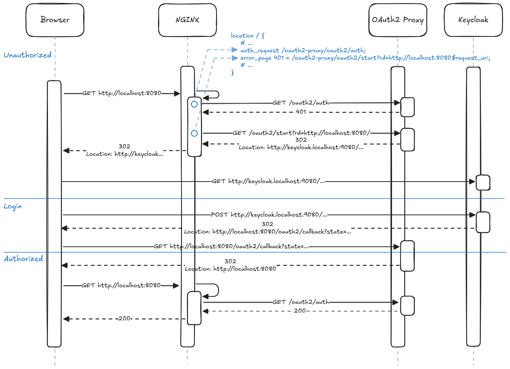

# NGINX OAuth2 Authentication

[](https://github.com/agebhar1/snippets/actions/workflows/nginx-oauth2.yml)

Generic client authentication in [NGINX](http://nginx.org/) can be achieved with the core [ngx_http_auth_request_module](http://nginx.org/en/docs/http/ngx_http_auth_request_module.html) (1.5.4+). It is based on the result of a sub-requests response code. Access is allowed if the sub-request returns a 2xx response code, otherwise access is denied.

> [!IMPORTANT]
> The module is not build by default if building from source and must be enabled with the `--with-http_auth_request_module`.

> [!NOTE]
> The official container image of NGINX is build with the module.

To implement OAuth2 client authentication with NGINX the [OAuth2 Proxy](https://github.com/oauth2-proxy/oauth2-proxy) can be used with the `ngx_http_auth_request_module` and [Keycloak](https://github.com/keycloak/keycloak) as OpenID Connect Provider for example.

For OAuth2 Proxy configuration see a.o.:
* [Configuration » Overview » Generating a Cookie Secret](https://oauth2-proxy.github.io/oauth2-proxy/configuration/overview/#generating-a-cookie-secret)
* [Configuration » OAuth Provider » OpenID Connect](https://oauth2-proxy.github.io/oauth2-proxy/configuration/providers/openid_connect/) (w/ Keycloak provider some errors occurs)

OAuth2 Proxy also provides some [example (container) setup files](https://github.com/oauth2-proxy/oauth2-proxy/tree/master/contrib/local-environment).

<br>
<br>



## Run Demo

> [!IMPORTANT] 
> the ports 8080 and 9080 will be used to bind NGINX on port 8080 and Keycloak on port 9080.
> OAuth2 Proxy port is used internal only and thus not exposed.

```shell
docker compose up -d
open http://localhost:8080
```

## Run e2e Test(s)

[Puppeteer](https://pptr.dev/) is used to run e2e test(s) in headless Chrome without user interaction.

```shell
cd e2e
docker compose up -d
npm install
npm run test
```

> [!NOTE] 
> In case of the following error, try one of the suggested links/solution
> 
> Error: Failed to launch the browser process!
[150953:150953:1211/154132.142434:FATAL:zygote_host_impl_linux.cc(128)] No usable sandbox! If you are running on Ubuntu 23.10+ or another Linux distro that has disabled unprivileged user namespaces with AppArmor, see https://chromium.googlesource.com/chromium/src/+/main/docs/security/apparmor-userns-restrictions.md. Otherwise see https://chromium.googlesource.com/chromium/src/+/main/docs/linux/suid_sandbox_development.md for more information on developing with the (older) SUID sandbox. If you want to live dangerously and need an immediate workaround, you can try using --no-sandbox.

e.g.:
```shell
echo 0 | sudo tee /proc/sys/kernel/apparmor_restrict_unprivileged_userns
```


