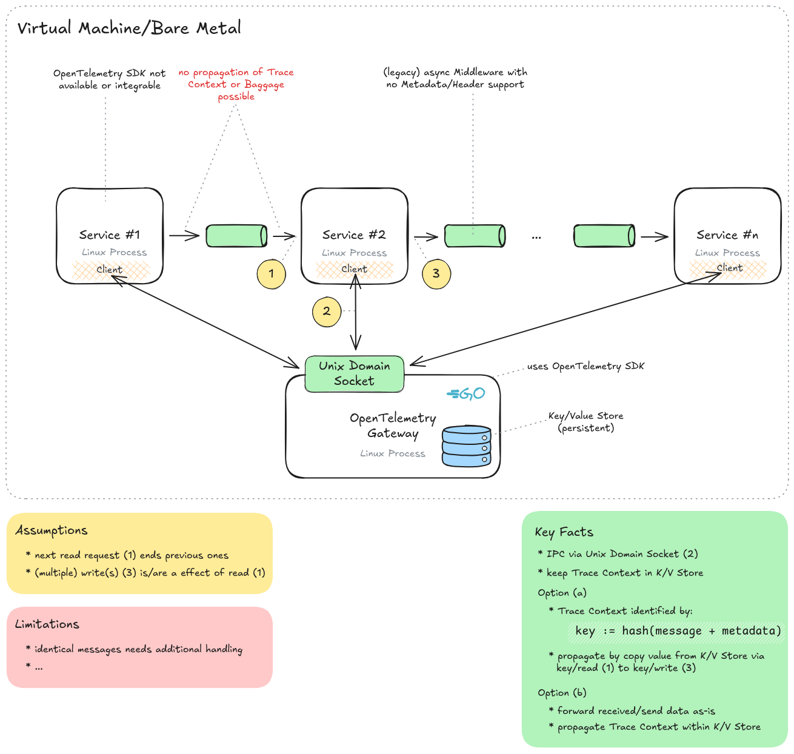
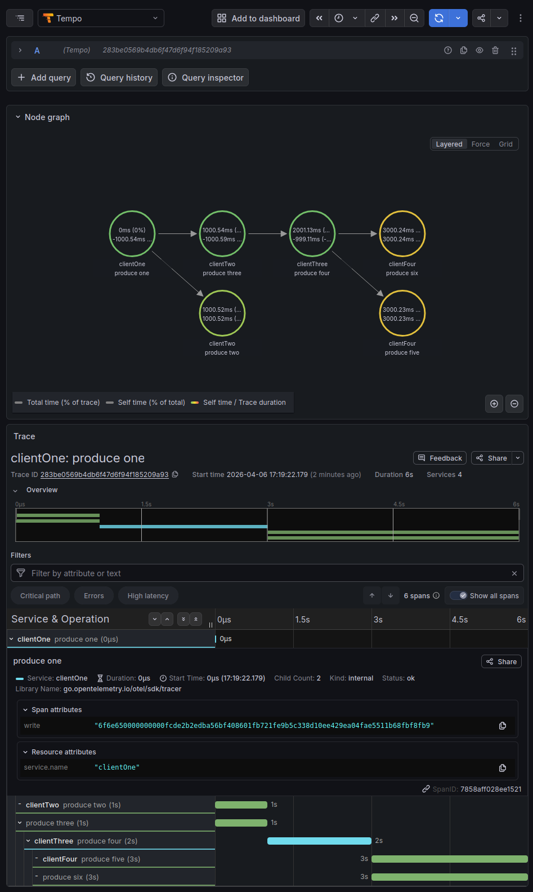

# [WIP] Proof Of Concept: Retrofitting legacy Linux processes with OpenTelemetry Trace

---

## Links

* [OpenTelemetry](https://opentelemetry.io/)
* [OpenTelemetry eBPF Instrumentation](https://opentelemetry.io/docs/zero-code/obi/)
* [Propagation format for distributed context: Baggage](https://www.w3.org/TR/baggage/) (W3C Candidate Recommendation)
* [Trace Context](https://www.w3.org/TR/trace-context/) (W3C Recommendation)
