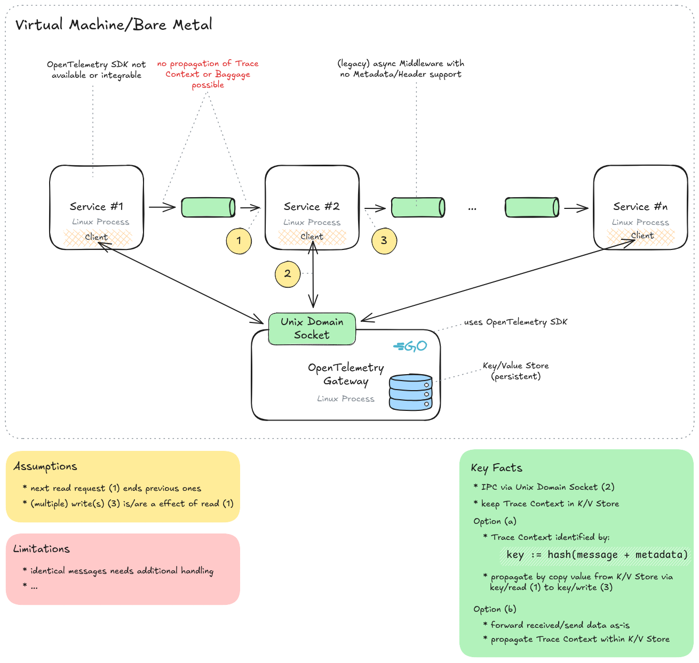
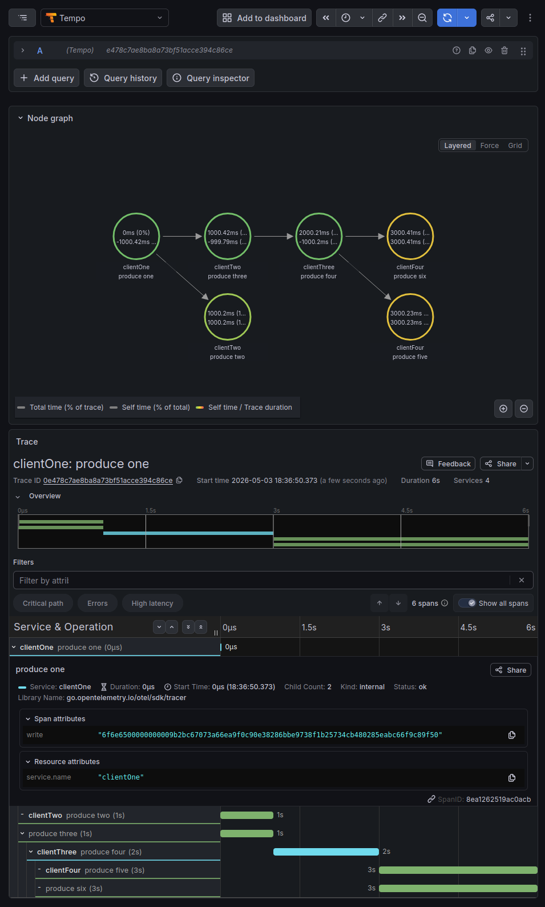

# [WIP] Proof Of Concept: Retrofitting legacy Linux processes with OpenTelemetry Trace



```shell
middleware/build/server
```

```shell
gateway/gateway
```

```shell
OTEL_SERVICE_NAME=clientTwo middleware/build/client -r one -w two -w three -d 1 &
OTEL_SERVICE_NAME=clientThree middleware/build/client -r three -w four -d 2 &
OTEL_SERVICE_NAME=clientFour middleware/build/client -r four -w five -w six -d 3 &
```

```shell
OTEL_SERVICE_NAME=clientOne middleware/build/client -w one
```



## Links

* [OpenTelemetry](https://opentelemetry.io/)
* [OpenTelemetry eBPF Instrumentation](https://opentelemetry.io/docs/zero-code/obi/)
* [Propagation format for distributed context: Baggage](https://www.w3.org/TR/baggage/) (W3C Candidate Recommendation)
* [Trace Context](https://www.w3.org/TR/trace-context/) (W3C Recommendation)
