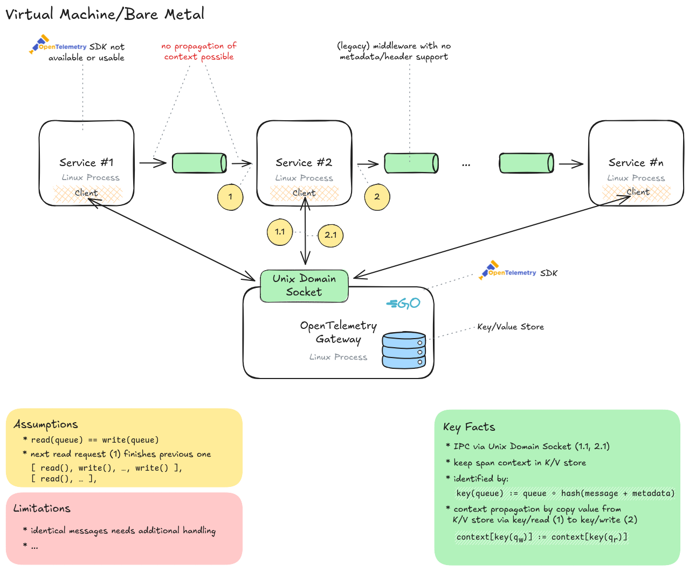
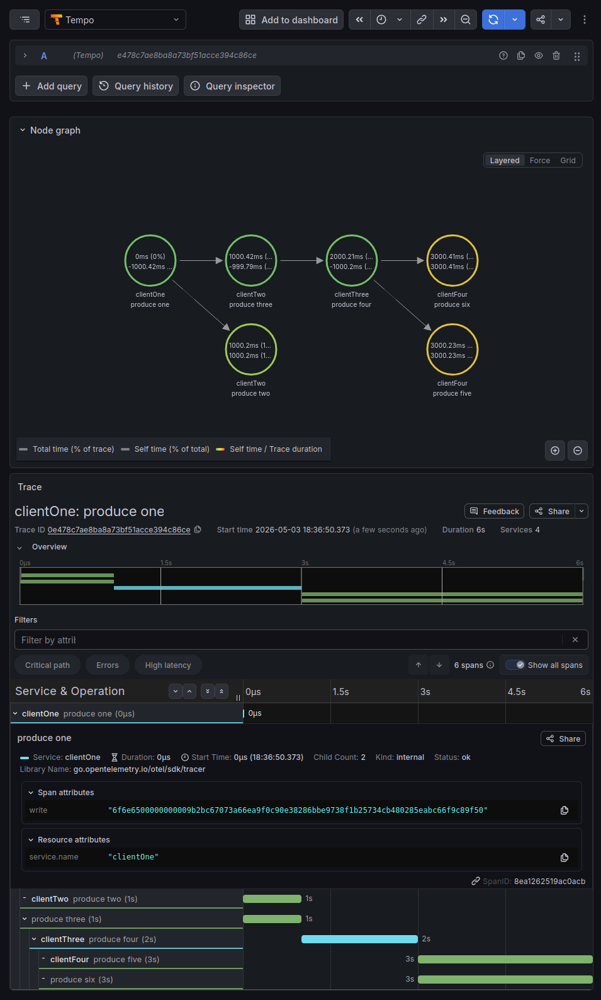

# [WIP] Proof Of Concept: Retrofitting legacy proprietary Linux middleware with OpenTelemetry Trace



```shell
cmake -S middleware -B build -DCMAKE_BUILD_TYPE=release
cmake --build build # --clean-first -v
build/server
```

```shell
go build -C gateway
gateway/gateway
```

```shell
OTEL_SERVICE_NAME=clientTwo build/client -r one -w two -w three -d 1 1>/dev/null 2>&1 &
OTEL_SERVICE_NAME=clientThree build/client -r three -w four -d 2 1>/dev/null 2>&1 &
OTEL_SERVICE_NAME=clientFour build/client -r four -w five -w six -d 3 1>/dev/null 2>&1 &
OTEL_SERVICE_NAME=clientOne build/client -w one
#
jobs -p | xargs kill
```



## Links

* [OpenTelemetry](https://opentelemetry.io/)
* [OpenTelemetry eBPF Instrumentation](https://opentelemetry.io/docs/zero-code/obi/)
* [Propagation format for distributed context: Baggage](https://www.w3.org/TR/baggage/) (W3C Candidate Recommendation)
* [Trace Context](https://www.w3.org/TR/trace-context/) (W3C Recommendation)
