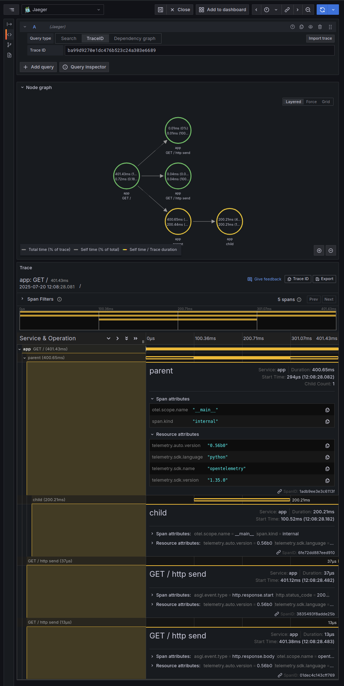
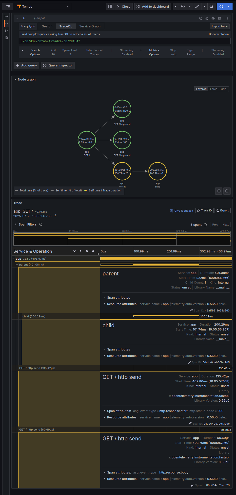

```shell
python3 -m venv venv
pip3 install -r requirements
# opentelemetry-bootstrap -a requirements
opentelemetry-bootstrap -a install
podman compose up -d
open http://localhost:3000
```

```shell
#export OTEL_PYTHON_LOG_CORRELATION=true
#export OTEL_PYTHON_LOG_FORMAT="%(msg)s [span_id=%(span_id)s]"
#export OTEL_PYTHON_LOG_LEVEL=debug
#export OTEL_PYTHON_LOGGING_AUTO_INSTRUMENTATION_ENABLED=true
export OTEL_EXPORTER_OTLP_PROTOCOL=http/protobuf
export OTEL_EXPORTER_OTLP_ENDPOINT=http://localhost:4318/ # OpenTelemetry Agent
opentelemetry-instrument --traces_exporter console,otlp --logs_exporter none --metrics_exporter none --service_name app python3 server.py
```

```shell
curl http://localhost:8000/
```

```text
INFO:     Started server process [118394]       
INFO:     Waiting for application startup.    
INFO:     Application startup complete.
INFO:     Uvicorn running on http://0.0.0.0:8000 (Press CTRL+C to quit)
INFO:     before parent span TraceID=ba99d9270e1dc476b523c24a303e6689 SpanID=f32e360db7caada9
INFO:     within parent span TraceID=ba99d9270e1dc476b523c24a303e6689 SpanID=1adb9ee3e3c6113f
INFO:     within child span TraceID=ba99d9270e1dc476b523c24a303e6689 SpanID=6fe72dd887eed910
INFO:     127.0.0.1:58500 - "GET / HTTP/1.1" 200 OK
```



```text
INFO:     Started server process [286025]
INFO:     Waiting for application startup.
INFO:     Application startup complete.                  
INFO:     Uvicorn running on http://0.0.0.0:8000 (Press CTRL+C to quit)
INFO:     before parent span TraceId=37d87d392b8fab9492ad2a9b8729f34f SpanId=a8f27e31c028a9fa
INFO:     within parent span TraceId=37d87d392b8fab9492ad2a9b8729f34f SpanId=45a1f9313e28a5d3
INFO:     within child span TraceId=37d87d392b8fab9492ad2a9b8729f34f SpanId=3d44a8beb80b49d5
INFO:     127.0.0.1:40566 - "GET / HTTP/1.1" 200 OK
```



## Links

### Blogs

* https://signoz.io/blog/opentelemetry-fastapi/
* https://signoz.io/comparisons/opentelemetry-trace-id-vs-span-id/
* https://last9.io/blog/integrating-opentelemetry-with-fastapi/
* https://medium.com/@lakinduboteju/integrating-opentelemetry-for-logging-in-python-a-practical-guide-fe52bff61edc
* https://medium.com/@juanluis1702/deploying-jaeger-prometheus-and-grafana-with-docker-compose-87d3bd499bbe
* https://www.infracloud.io/blogs/tracing-grafana-tempo-jaeger/

### OpenTelemetry

* [Logging Library SDK Prototype Specification](https://github.com/open-telemetry/opentelemetry-specification/blob/v1.47.0/oteps/logs/0150-logging-library-sdk.md)
* [Overview](https://opentelemetry.io/docs/specs/otel/overview/)
* [Logs Data Model](https://opentelemetry.io/docs/specs/otel/logs/data-model/)

#### Collector

* [Configuration](https://opentelemetry.io/docs/collector/configuration/)
* [Gateway](https://opentelemetry.io/docs/collector/deployment/gateway/)
* [Resiliency](https://opentelemetry.io/docs/collector/resiliency/)

#### Language APIs & SDKs

* https://opentelemetry.io/docs/languages/sdk-configuration/otlp-exporter/
* https://opentelemetry.io/docs/zero-code/python/configuration/
* https://opentelemetry.io/docs/zero-code/python/troubleshooting/#connectivity-issues

#### GitHub (Python)

* https://github.com/open-telemetry/opentelemetry-python/tree/main/docs/examples/auto-instrumentation

### OpenTelemetry-Python-Contrib

```shell
pip install opentelemetry-exporter-{exporter}
pip install opentelemetry-instrumentation-{instrumentation}
pip install opentelemetry-sdk-extension-{sdk-extension}
```

#### Instrumentations

* [Confluent Kafka](https://opentelemetry-python-contrib.readthedocs.io/en/latest/instrumentation/confluent_kafka/confluent_kafka.html)
* [FastAPI](https://opentelemetry-python-contrib.readthedocs.io/en/latest/instrumentation/fastapi/fastapi.html)
* [Logging](https://opentelemetry-python-contrib.readthedocs.io/en/latest/instrumentation/logging/logging.html)
* [SQLAlchemy](https://opentelemetry-python-contrib.readthedocs.io/en/latest/instrumentation/sqlalchemy/sqlalchemy.html)

### Logging

* https://docs.python.org/3/howto/logging-cookbook.html
  * [Implementing structured logging](https://docs.python.org/3/howto/logging-cookbook.html#implementing-structured-logging)
* [WatchedFileHandler](https://docs.python.org/3/library/logging.handlers.html#watchedfilehandler)
* https://signoz.io/guides/how-to-write-to-a-file-using-the-logging-python-module/