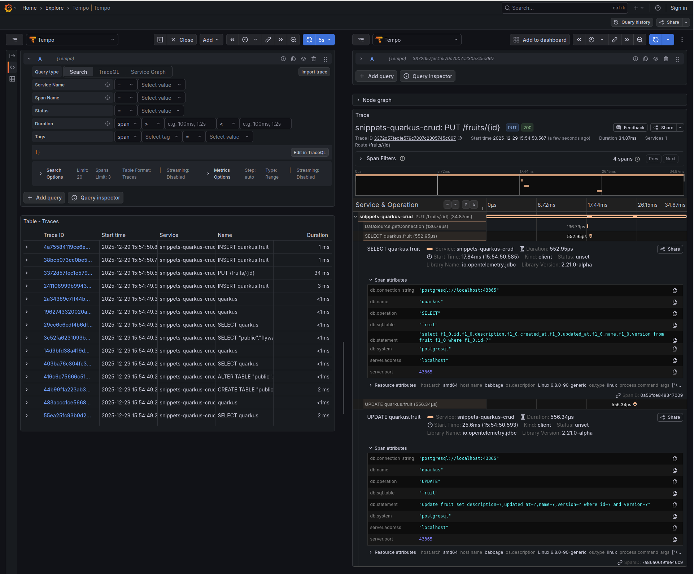

# Quarkus REST Microservice

A Quarkus REST Microservices with (✓ Done, ✗ TODO):

* REST API
    * validation w/ Hibernate Validator ✓
    * error handling w/ [RFC 9457 Problem Details for HTTP APIs](https://www.rfc-editor.org/rfc/rfc9457.html) ✓
* Persistence:
    * Hibernate ORM w/ Panache Repository ✓
    * use [JPA Field Access](https://jakarta.ee/specifications/persistence/3.2/jakarta-persistence-spec-3.2#a113) first (do not clutter source code with unnecessary getter/setter) ✓
    * database schema management w/ [Flyway](https://github.com/flyway/flyway) ✓
    * using RFC 9562 Universally Unique
      IDentifiers [UUIDv7](https://www.rfc-editor.org/rfc/rfc9562.html#name-uuid-version-7) as primary key in
      PostgresSQL ([18](https://www.postgresql.org/docs/current/release-18.html)+) ✓
    * optimistic locking (by JPA `@Version`) ✓
    * tracking creation/update timestamp (by JPA `@CreationTimestamp`/`@UpdateTimestamp`) ✓
* Security ✗
* Observability:
    * (K8s) Health ✗
    * structured logging w/ runtime log level adjustment ✓
    * OpenTelemetry [Traces](https://opentelemetry.io/docs/concepts/signals/traces/) ✓
    * OpenTelemetry [Metrics](https://opentelemetry.io/docs/concepts/signals/metrics/) ✗
* Quality:
    * [Boundary Control Entity Architecture](https://bce.design/) ✓
    * Null-Safety w/ [JSpecify](https://jspecify.dev/) ✓
        * [NullAway: Fast Annotation-Based Null Checking for Java](https://github.com/uber/NullAway)
            * [JSpecify Support](https://github.com/uber/NullAway/wiki/JSpecify-Support)
    * static analysis w/ [Error Prone](https://errorprone.info/) ✓
    * comprehensive (integration) testing
        * assert logging ✗

## Details

### Development

```shell
mvn quarkus:dev
```

Open Quarkus Dev UI at http://localhost:8080/q/dev-ui.

### Testing

```shell
# export GRAALVM_HOME=~/.sdkman/candidates/java/21-graalce/
mvn clean verify [-Dnative]
```

### Observability

[Using OpenTelemetry](https://quarkus.io/guides/opentelemetry):
> [!NOTE]
> The use of **the [OpenTelemetry Agent](https://opentelemetry.io/docs/zero-code/java/agent/) is not needed nor
recommended**. Quarkus Extensions and the libraries they provide,
> are directly instrumented. That agent doesn’t work with native mode.

Screenshot of Explore » Tempo in Grafana after running test(s):


## References/Links

* [Get Started](https://quarkus.io/get-started/)
* [All configuration options](https://quarkus.io/guides/all-config)

### Quarkus Guides

* [Writing REST Services with Quarkus REST](https://quarkus.io/guides/rest)
* [Generating Jakarta REST resources with Panache](https://quarkus.io/guides/rest-data-panache)
* [Writing JSON REST Services](https://quarkus.io/guides/rest-json)
* [Validation with Hibernate Validator](https://quarkus.io/guides/validation)
* [Configure data sources in Quarkus](https://quarkus.io/guides/datasource)
    * [Datasource health check](https://quarkus.io/guides/datasource#datasource-health-check)
* [Using Hibernate ORM and Jakarta Persistence](https://quarkus.io/guides/hibernate-orm)
* [Simplified Hibernate ORM with Panache](https://quarkus.io/guides/hibernate-orm-panache)
* [Using Flyway](https://quarkus.io/guides/flyway)
* [Logging configuration](https://quarkus.io/guides/logging)
    * [JSON logging format](https://quarkus.io/guides/logging#json-logging) does **not** support structured logging by
      logger
* [SmallRye Health](https://quarkus.io/guides/smallrye-health)
* [Observability in Quarkus](https://quarkus.io/guides/observability)
* [Using OpenTelemetry](https://quarkus.io/guides/opentelemetry)
    * [Resource](https://quarkus.io/guides/opentelemetry#resource)
    * [OpenTelemetry Resource Providers](https://github.com/open-telemetry/opentelemetry-java-instrumentation/blob/main/instrumentation/resources/library/README.md#opentelemetry-resource-providers)
* [Testing Your Application](https://quarkus.io/guides/getting-started-testing)
* [Dev Services Overview](https://quarkus.io/guides/dev-services)
    * [Compose Dev Services](https://quarkus.io/guides/compose-dev-services)
    * [Dev Services for Databases](https://quarkus.io/guides/databases-dev-services)
* [Building a Native Executable](https://quarkus.io/guides/building-native-image)
    * [Build a Statically Linked or Mostly-Statically Linked Native Executable](https://www.graalvm.org/jdk21/reference-manual/native-image/guides/build-static-executables)

### Quarkus Blog

* [Explore a new way of testing CDI components in Quarkus](https://quarkus.io/blog/quarkus-component-test/)

### Quarkiverse

* https://github.com/quarkiverse/quarkus-logging-manager
* https://github.com/quarkiverse/quarkus-logging-json
    * https://docs.quarkiverse.io/quarkus-logging-json/dev/index.html

### [Baeldung](https://www.baeldung.com/)

* [Custom @IdGeneratorType With Manually Assigned Identifier](https://www.baeldung.com/hibernate-identifiers#6-custom-idgeneratortype-with-manually-assigned-identifier)
* [Guide to Hibernate’s @TimeZoneStorage Annotation](https://www.baeldung.com/hibernate-timezonestorage)
* [Generate UUIDs as Primary Keys With Hibernate](https://www.baeldung.com/java-hibernate-uuid-primary-key)
* [A Practical Guide to Null-Safety in Java With JSpecify](https://www.baeldung.com/java-jspecify-null-safety)
* [Asserting REST JSON Responses With REST-assured](https://www.baeldung.com/java-rest-assured-assert-json-responses)
* [Count your queries! Repository integration tests with Hibernate Statistics](https://www.codecentric.de/en/knowledge-hub/blog/count-your-queries-repository-integration-tests-hibernate-statistics)

### [Thorben Jansen](https://thorben-janssen.com/)

* [Access Strategies in JPA and Hibernate – Which is better, field or property access?](https://thorben-janssen.com/access-strategies-in-jpa-and-hibernate/)
* [Introduction to Panache](https://thorben-janssen.com/introduction-panache/)
* [How To Map The Date And Time API with JPA 2.2](https://thorben-janssen.com/map-date-time-api-jpa-2-2/)

### [The Main Thread](https://www.the-main-thread.com/) - Markus Eisele

* [Compile-Time Null Safety in Quarkus: Stop NullPointerExceptions Before They Happen](https://www.the-main-thread.com/p/compile-time-null-safety-quarkus-jspecify-nullaway)
* [Logging Reloaded: Quarkus Edition](https://www.the-main-thread.com/p/logging-reloaded-quarkus-edition)
* [Versioning APIs in Quarkus: Four Strategies Every Java Developer Should Know](https://www.the-main-thread.com/p/quarkus-api-versioning-strategies-java)
* [The Quarkus Test Matrix: Escape Flaky Tests and Embrace Dev Services Magic](https://www.the-main-thread.com/p/quarkus-dev-services-continuous-testing)
* [Mastering Database Migrations in Java: A Hands-On Guide with Quarkus and Flyway](https://www.the-main-thread.com/p/quarkus-flyway-database-migrations-java)
* [Time Zones Don’t Have to Be a Nightmare: Handling Dates Properly with Quarkus and Hibernate Panache](https://www.the-main-thread.com/p/quarkus-java-timezone-best-practices)
* [Small and Efficient Containers: Quarkus + Jib + Mandrel for Lightning-Fast Java Apps](https://www.the-main-thread.com/p/quarkus-jib-mandrel-native-containers)
* [RFC 9457 Explained: The New Error Handling Standard for Java/Quarkus (vs RFC 7807)](https://www.the-main-thread.com/p/quarkus-rfc9457-api-error-handling)

### Others

* [Locales default set at run-time starting with GraalVM/Mandrel 24.2 for JDK 24, how to handle in Quarkus?](https://github.com/quarkusio/quarkus/discussions/43533)
* [Quarkus Cheat-Sheet](https://lordofthejars.github.io/quarkus-cheat-sheet/)
* [Development and Testing of Quarkus applications using Testcontainers](https://testcontainers.com/guides/development-and-testing-quarkus-application-using-testcontainers/)
* [What Is Structured Logging and How to Use It](https://www.loggly.com/use-cases/what-is-structured-logging-and-how-to-use-it/)
* [Why Structured Logging is Fundamental to Observability ](https://betterstack.com/community/guides/logging/structured-logging/)
* [Google Error-Prone, Uber NullAway in Java applications](https://medium.com/@truongbui95/google-error-prone-uber-nullaway-in-java-applications-230f6cf32b8f)
* [Improving Java Nulls Using JSpecify and NullAway](https://medium.com/inbank-product-and-engineering/improving-java-nulls-using-jspecify-and-nullaway-12499a232c69)

---

## TODO ✗

* [Provide JUnit extension to capture output streams in QuarkusTest](https://github.com/quarkusio/quarkus/issues/38202)
* [Hibernate's @Version annotation to enable Optimistic Locking is ignored when using Panache](https://github.com/quarkusio/quarkus/issues/7193)
* [Provide easy way to clear / repopulate a database in tests without restarting the application](https://github.com/quarkusio/quarkus/issues/14240)
* [Using Java Flight Recorder](https://quarkus.io/guides/jfr)
* [Observability Dev Services with Grafana OTel LGTM](https://quarkus.io/guides/observability-devservices-lgtm)
* [Micrometer and OpenTelemetry extension](https://quarkus.io/guides/telemetry-micrometer-to-opentelemetry)
* https://github.com/quarkusio/quarkus/blob/main/extensions/hibernate-orm/deployment/src/main/java/io/quarkus/hibernate/orm/deployment/HibernateOrmProcessor.java (
  CurrentTimestampGeneration -> hibernate.testing.clock)
